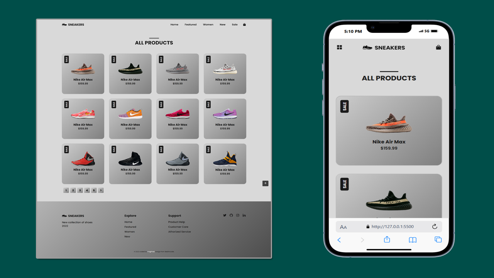

## Table of contents

- [Overview](#overview)
  - [Screenshot](#screenshot)
  - [Links](#links)
- [My process](#my-process)
  - [Built with](#built-with)
  - [What I learned](#what-i-learned)

## Overview
Sneakers is a modern and stylish static e-commerce landing page designed to showcase and promote Nike Air Max sneakers. Built with clean HTML, CSS, and responsive design principles, this site delivers a visually engaging user experience across all devices. The project highlights:

- A preloader animation for a polished entry experience.
- A sticky header with intuitive navigation for easy browsing.

- A product sale section featuring multiple sneakers with promotional tags and consistent styling.

- Interactive buttons and hover effects to enhance engagement.

- Responsive design, making the layout adapt gracefully to different screen sizes.

This site is ideal for practice in frontend development, static site deployment, and e-commerce layout design using only HTML and CSS.

### Screenshot

### Links

- Solution URL: [View Code](https://github.com/Ramelzkie96/sneakers.git)
- Live Site URL: [Live Site](https://sneaker-page.netlify.app/)

## My process

### Built With
- **HTML5** – Markup structure
- **CSS3** – Styling and layout
- **JavaScript (ES6+)** – Interactivity and functionality

### External Libraries & Tools
- [Boxicons](https://boxicons.com/) – Icon library
- [Swiper.js](https://swiperjs.com/) – Touch slider/swiper for carousels
- [ScrollReveal](https://scrollrevealjs.org/) – On-scroll animations

### What I Learned

- How to structure and build a fully responsive static website using only HTML, CSS, and JavaScript.
- Improved my understanding of **flexbox** and **CSS grid** for layout design.
- Learned how to implement **Swiper.js** for creating interactive sliders/carousels.
- Integrated **ScrollReveal** to animate elements on scroll for better user engagement.
- Used **Boxicons** to add scalable vector icons in a clean and lightweight way.
- Enhanced my skills in organizing project files and assets for maintainability.
